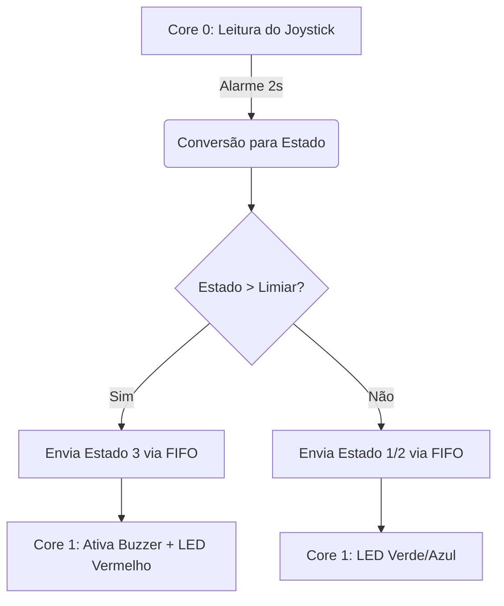

# ATIVIDADE: Cap 2: Aplicação Multitarefa

### **Arquitetura Dual-Core**
| Componente          | Implementação                                                                               |
|----------------------|---------------------------------------------------------------------------------------------|
| **Core 0**           | Responsável pela leitura do joystick e envio periódico de estados                           |
| **Core 1**           | Responsável pelo controle dos atuadores (LED + Buzzer)                                      |
| **Comunicação**      | FIFO inter-core para transferência de estados                                               |

### **Funcionalidades Implementadas**
- 🕹 **Entrada Analógica**  
  ✅ Leitura do eixo X do joystick via ADC (GP27)  
  ✅ Conversão para 3 estados de operação:
  ```c
  if (joystick_value <= LIMIAR_BAIXA) estado = 1;      // Baixo
  else if (joystick_value <= LIMIAR_MODERADA) estado = 2; // Moderado
  else estado = 3;                                       // Alto
  ```

- 💡 **Sinalização Visual**  
  ✅ LED RGB com cores específicas por estado:  
  - 🟢 Verde (Estado 1 - Baixo)  
  - 🔵 Azul (Estado 2 - Moderado)  
  - 🔴 Vermelho (Estado 3 - Alto)  

- 🚨 **Alerta Sonoro**  
  ✅ Buzzer ativado via PWM apenas no Estado 3 (Frequência: ~2kHz)  
  ```c
  pwm_set_gpio_level(BUZZER_A_PIN, (estado == 3) ? 31249 : 0); // 50% duty cycle
  ```

- ⏱ **Temporização Precisão**  
  ✅ Alarme periódico de 2 segundos no Core 0:  
  ```c
  add_alarm_in_ms(2000, callback, NULL, true);
  ```

- 🔄 **Comunicação Inter-Core**  
  ✅ FIFO para transferência segura de estados:  
  ```c
  // Core 0 (Envio)
  multicore_fifo_push_blocking(estado);
  
  // Core 1 (Recepção)
  uint8_t estado = multicore_fifo_pop_blocking();
  ```

- 🧮 **Gestão de Estados**  
  ✅ Variável atômica para compartilhamento seguro:  
  ```c
  volatile uint8_t global_state; // Acessada por ambos os núcleos
  ```

**Saída Esperada**:
```
Core 0: Lendo Joystick X = 2875
Core 0: Estado = 3 (Alta). Enviando para Core 1...
Core 1: Estado ALTO! Ativando buzzer.
Core 1: LED Vermelho.
```

## 📊 Diagrama de Fluxo


## 🔧 Configuração de Limiares
| Parâmetro            | Valor   | Cálculo          | Descrição                     |
|----------------------|---------|------------------|-------------------------------|
| `LIMIAR_BAIXA`       | 1365    | 4095 / 3         | Transição Baixo → Moderado    |
| `LIMIAR_MODERADA`    | 2730    | 4095 × 2/3       | Transição Moderado → Alto     |

## 🛠 Estrutura do Código
```plaintext
bitdoglab-monitor/
└── main.c
    ├── Core 0
    │   ├── Leitura ADC
    │   ├── Classificação de Estados
    │   └── Comunicação FIFO
    └── Core 1
        ├── Controle LED RGB
        └── Controle Buzzer PWM
```
